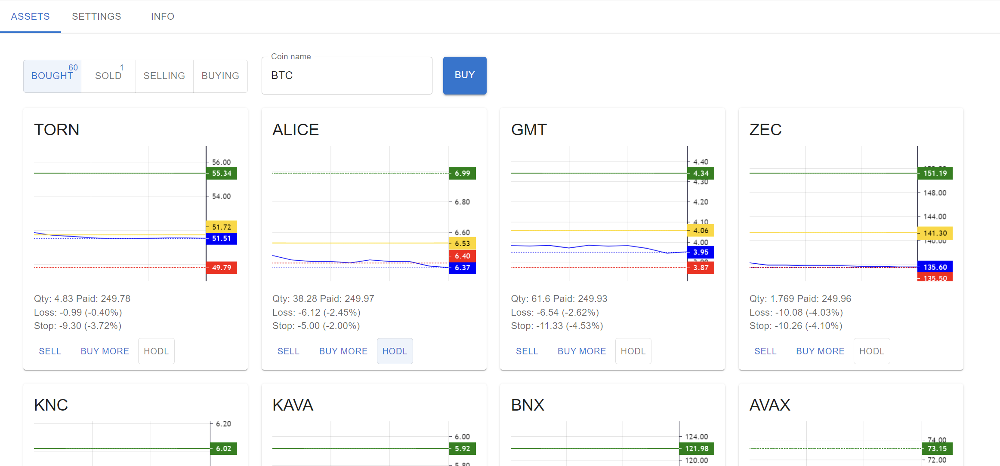

# trading-helper

The project to help you with crypto trading, written for Google Apps Script.

The current features are:
* Integration with Binance: buy and sell coins on the spot.
* Set up your profit and loss limits to automatically sell coins when you reach them.
* A moving stop-loss limit, which goes up together with the price.
* Swing trading: automatically sell and buy coins when the price goes up or down.
* Your statistics: see how much you have made and how much you have lost on a daily basis.

## How to

### You will need

1. Google account.
2. Binance account and Binance API token and key for spot trading.

### Setup

See the [YouTube playlist](https://www.youtube.com/playlist?list=PLAiqSgC5hs1fcFglYk81W7hpNRJbqu0Ox) on how to set up and use the tool.

Links:
* Get the latest published version: [trading-helper (latest)](https://github.com/bogdan-kovalev/trading-helper/releases/latest)
