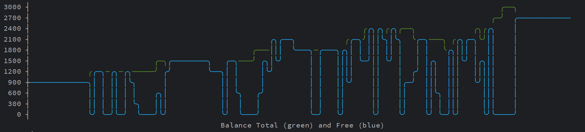

# trading-helper

The project to help you with crypto trading, written for Google Apps Script.

The most secure trading tool, as you deploy your own WEB application, and create and connect to your own database.
No one, except you, have access to the WEB-application and the data. If you trust Google, you can trust the project.

## Features

* Free Cloud hosting on Google Apps Script.
* Web UI (desktop/mobile).
* Monitors the market 24/7 and shows great investment candidates.
* Fully-autonomous trading on Binance Spot without manual interventions whatsoever:
  * Enabled automatically once you become a Patron: [patreon.com/bogdantimes](https://patreon.com/bogdantimes).
  * 🤙🏻 Reach out to me if you want to test it for free (see [Contact](#contact) section).
* Gmail notifications.
* Optional external database (Firebase).
* Info page with balance changes since Day 1.

## Back-testing

Running on a historical data like if it was trading in the past.

**Dates:** September 2022 -> March 2023 (6 months)
**Stable coin**: USDT
**Best Result:** `$1,000 -> $2,711 (+171% profit)`

## Screenshots

## How to

### You will need

1. Google account.
2. Optional: Binance API keys.
   Binance keys are needed if you are going to use the autonomous trading functionality.

### Set up

Links are in the [latest release](https://github.com/bogdantimes/trading-helper/releases/latest).
Clone the latest public release of the Google Apps Script project to your Google account (you can follow the tutorial video).

### Set up from sources

To set up from sources using the command line interface - see [CONTRIBUTING.md](./CONTRIBUTING.md)

## Contact

Subscribe for updates:
* [t.me/tradinghelperblog](https://t.me/tradinghelperblog)

Be a friend:
* 
* [instagram.com/bogdantimes](https://instagram.com/bogdantimes)

Support the project:
* [patreon.com/bogdantimes](https://patreon.com/bogdantimes)
