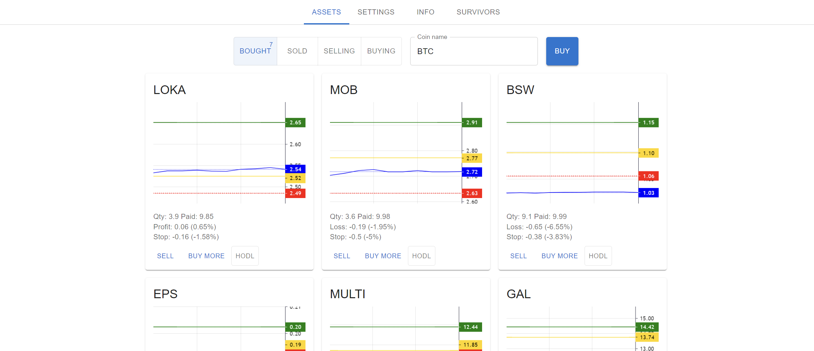
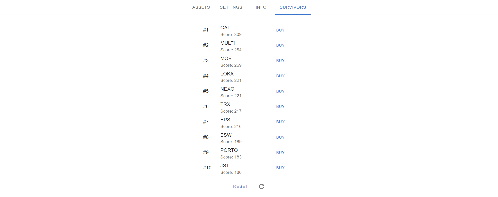

# trading-helper

The project to help you with crypto trading, written for Google Apps Script.

The most secure trading tool, as you deploy your own WEB application, and create and connect to your own database.
No one, except you, have access to the WEB-application and the data. If you trust Google, you can trust the project.

### Toss a coin to your witcher

Buy me a coffee, to support this project. It will not evolve without your support!

* [patreon.com/bogdantimes](patreon.com/bogdantimes)
* [revolut.me/bogdantimes](revolut.me/bogdantimes)
* USDT/USDC/BUSD/BNB: **0x8aed61ca4e9fe5c221839ceb82c5f3f034d6b60e** (BEP20)

## Features

* Integration with Binance: buy and sell coins on the spot.
* Set up your profit and stop limits to automatically sell coins when the limits are crossed.
* A moving stop-limit, which goes up together with the price.
* A stop-limit based on a total profit of the tool.
* Price anomalies detection (pump or dump) with an option to auto-buy when price drops.
* Swing trading: automatically buy low and sell high during the rally.
* Averaging down: automatically re-invest gains into most unprofitable coins to buy them at discount prices.
* Your statistics: see how much you have made and how much you have lost on a daily basis.
* Survivors: currencies that show movement up when 99% of the market goes down or not moves.

### Assets

### Settings

### Info

### Survivors

## How to

### You will need

1. Google account.
2. Binance account and Binance API token and key for spot trading.

### Set up the latest build

There are ready to use builds published in the Google Apps Script and made available to everyone via a link.
Links are attached to each release. See [latest release](https://github.com/bogdan-kovalev/trading-helper/releases/latest).

You will need to clone the Google Apps Script project to your account and set it up.
See the [Tutorials playlist on YouTube](https://www.youtube.com/playlist?list=PLAiqSgC5hs1fcFglYk81W7hpNRJbqu0Ox). The setup was simplified as much as possible for this kind of project.

### Set up from sources

Setting up using the command line interface.
See [CONTRIBUTING.md](./CONTRIBUTING.md) to set up the tool from sources.
